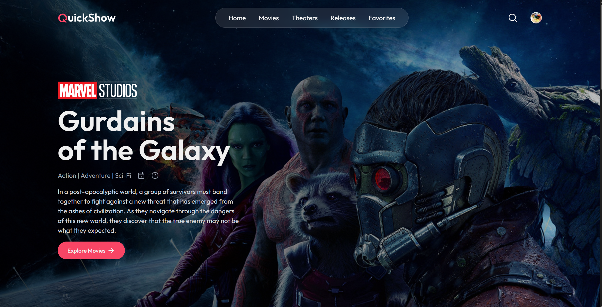

# MovieQuickShow
MovieQuickShow is a modern web application for browsing, booking, and managing movie shows. It features an elegant UI, secure Clerk-based authentication, and seamless payment integration. The project is live and accessible online at [movie-quick-show-frontend.vercel.app](https://movie-quick-show-frontend.vercel.app/).

## Screenshots


*Home page showcasing featured movies and showtimes.*


*Home page showcasing featured movies and showtimes.*


*SeatBooking page showcasing featured times and seatLayout.*


*MovieBooking page showcasing featured showtimes.*


*Admin panel for managing movies, shows, and bookings.*

## Features

- Browse movies and showtimes
- Book tickets online
- Admin panel for managing movies, shows, and bookings
- Elegant user interface
- Secure user authentication and authorization with Clerk
- Payment processing with Stripe
- Email notifications for bookings and updates

## Project Architecture

| Layer           | Technology                                      |
|-----------------|-------------------------------------------------|
| **Frontend**    | React, Tailwind CSS, Context API, Elegant UI    |
| **Backend**     | Node.js, Express.js                             |
| **Database**    | MongoDB, Mongoose                               |
| **Authentication** | Clerk / JWT + bcrypt                        |
| **Payments**    | Stripe                                          |
| **Mailing**     | Nodemailer, Inngest                             |
| **Deployment**  | Vercel (Frontend), Vercel (Backend), MongoDB Atlas |

## Getting Started

1. Clone the repository:
    ```bash
    git clone https://github.com/yourusername/MovieQuickShow.git
    ```
2. Install dependencies for both frontend and backend.
3. Set up environment variables as described in `.env.example`.
4. Run the development servers:
    ```bash
    cd frontend
    npm run dev
    cd ../backend
    npm run server
    ```

## Admin Panel

The admin panel allows authorized users to:
- Add, edit, or remove movies and showtimes
- View and manage bookings
- Access analytics and reports

## License

This project is licensed under the MIT License.
